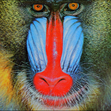
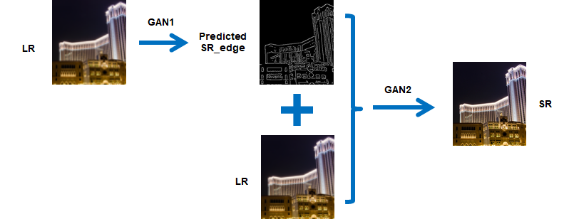
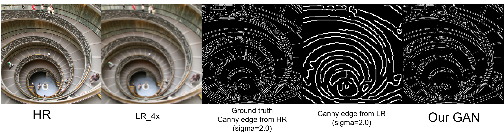
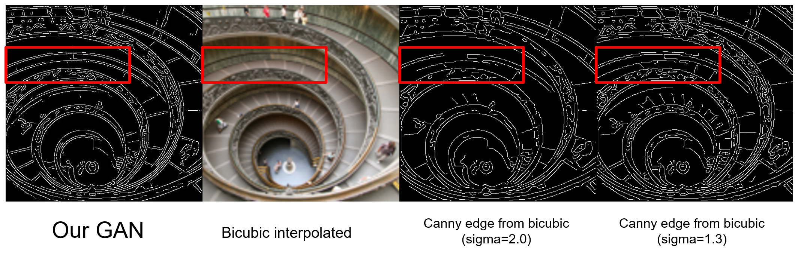
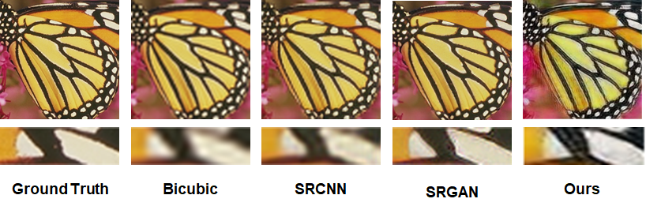
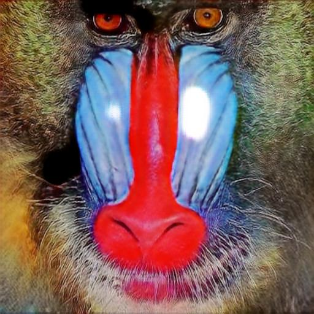

# CS766 Project
## Edge-based Image Super-Resolution
##### Group members: Yunhan Hu, Ruohui Wang, Xin Yuan

### Single Image Super-Resolution

Image super-resolution is the task of generating high-resolution images from low-resolution images. Due to the limitations of some actual scenes, only one low-resolution image is often available. Super-resolution using only one low-resolution image is single-image super-resolution. Since one low-resolution image corresponds to several high-resolution images, super-resolution is an ill-defined problem. Therefore, additional prior knowledge is needed to constrain the recovered high-frequency information. The state-of-the-art methods are based on deep learning. Specifically, it uses the similarity of different images in high-frequency details to obtain the relationship between high-resolution and low-resolution images to guide the reconstruction of high-resolution images.

--->

### Applications

In addition to being a research direction in computer vision, super-resolution also has many practical applications. For example, video enhancement can repair some old videos. Various medical imaging is limited by physical conditions and radiation safety, and the resolution cannot be increased arbitrarily. In this case, super-resolution can improve the quality of medical images. Similarly, remote sensing and astronomical observations are limited by the optical diffraction limit, and the resolution is difficult to improve, so super-resolution can also be used.

- Regular video information enhancement
- Surveillance
- Medical diagnosis
- Earth-observation remote sensing
- Astronomical observation
- Biometric information identification

### Approach

In this project, we proposed a two-stage generative adversarial network (GAN) for single image super-resolution. The first stage is the high-resolution edge prediction network (G1), which takes in the low-resolution image and edge as the input, outputs the predicted high-resolution edge image. The second stage is the image inpainting network (G2), which takes in the predicted high-resolution edge from G1 and low resolution image, outputs the final super-resolution image.

### Implementation

#### Dataset

The superresolution task requires many types of the original images -- a single image needs to be scaled to 512x512 to be processed by the network, and aside from that, it has multiple downscaled version (2x, 4x for example). In edge-informed super resolution, we also need the detected edges of these images, either by Canny or the edge model. To manage images of these many type, and choose the versions of the images we want, we implemented `SRDataset`, a class that can generate, feed images. This improves the performance compared to the authors' version that preprocesses the image during training.

#### Source codes
The source codes are at [CS766_Project](https://github.com/hyh9335/CS766_Project).

### Result and comparsion

#### Edge generation 

In this study, we use the edge generated by Canny edge detector from HR image as our ground truth. The sigma parameter is chosen to be 2.0 for all dataset. As shown above, we notice that the edge directly generated from LR image using the same setting is not a fair comparison because of fewer pixels the frame has. To find a better baseline to compare our results, we consider to first scale the frame to the same size as HR by doing a bicubic interpolation and then extract the edge from this "trivial" SR image. 

After scaling up the frame, the edge recovered by Canny edge detector gives a better resolution, but under the same sigma parameter, it loses most of the details, which can be recovered in our GAN result. A smaller sigma value in Canny edge detector leads to a higher detection sensitivity, which can provides more fine structures, but we can see that the quality of the edge is worse than our GAN. Especially, the curves in the LR image will be chopped into segments by the limited resolution, which cannot be properly recovered by the bicubic interpolation, thus the Canny edge detector also generates segments instead of a smooth curve. 

To quantitatively evaluate the performance of our edge generation model, we define two metrics as following:

$$Recall=\frac{\text {# of points correctly predicted}}{\text {# of points on ground Truth}}\ \ \ \ \ \ \ \ \ Precision=\frac{\text {# of points correctly predicted}}{\text {# of points been predicted}}$$

An edge image with a low recall value fails to capture the edge pixels from the ground truth, while an edge image with a low precision value generates many incorrect edge pixels. 

<table>

<tr><td>

| 4X | Recall | Precision |
|----|----|----|
|Optimized Canny|0.529|0.472|
|Our GAN|0.618|0.552|

</td><td>

| 2X | Recall | Precision |
|----|----|----|
|Optimized Canny|0.573|0.752|
|Our GAN|0.701|0.782|

</td></tr> </table>

We looked at 20 different sigmas for edge detection from bicubic interpolated images, and take out the highest recall and precision as 'optimized Canny'. Compared to the best result that Canny edge detection can achieve from bicubic interpolated image, our GAN model still performs better. 

However, our GAN still shows some shortcomings, in terms of discontinuity of the predicted edge, which may be further improved the choise of loss function. 

#### Super-resolution Result
The super-resolution results of SET14 are in [2x downsampling](https://github.com/hyh9335/CS766_Project/tree/gh-pages/pred_full_lr2x) and [4x downsampling](https://github.com/hyh9335/CS766_Project/tree/gh-pages/pred_full_lr4x).

#### Comparsion

| Model | PSNR | SSIM |
|----|----|----|
|Bicubic|25.99|0.7031|
|SRCNN|27.50|0.7513|
|SRGAN|26.02|0.7397|
|Ours|25.19|0.9134|

This is the result of our network evaluation. The testing set is set 14. Downsampling is 4 times. The results show that the PSNR is low. This is because the loss function of our network is not PSNR-oriented, and the network has not fully converged due to limited computing power. SSIM is very high. This is normal because we use edge images, which is equivalent to inputting structural information into the network.

These images are ground truth, bicubic, SRCNN, SRGAN and our network. As a result, our image is better than bicubic and SRCNN, and is close to the result of SRGAN. However, our pictures have chromatic aberration and noise, which is why the PSNR is low.

### Problems

The picture above is the output of our network. As you can see, there are white patches in the picture. This phenomenon sometimes appears in the output results. There are several possible reasons for this phenomenon. One is the instability of GAN training. How to train GAN has always been the difficulty of GAN. The second is that insufficient computing power has caused the network to not fully converge. The third is the problem of the network structure itself. A similar phenomenon appeared in the original paper.
The solution is to replace the GAN network structure and try to use a deeper network for training, such as SRGAN.